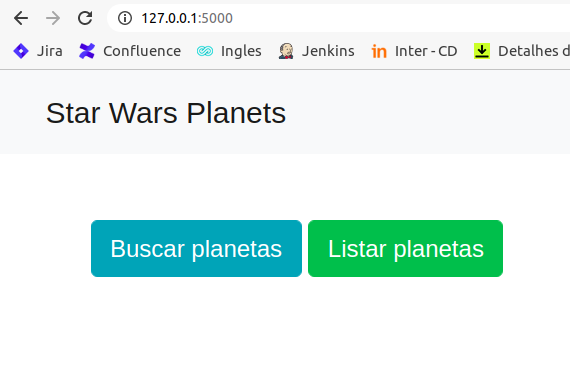
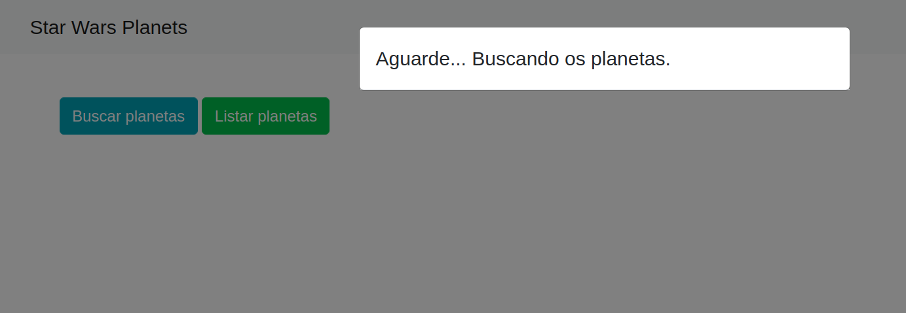
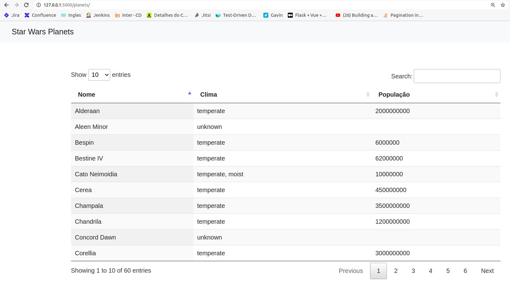
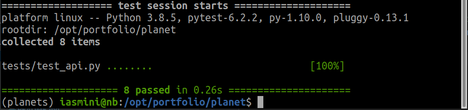

# planet
Get a list of planets from a [public API](http://swapi.dev/api/), saves it on a SQLite database and show the data in a Datatable. Made with Flask.  
It's also available an API Rest.

## Images




## Installation
1. Clone the [repo](https://github.com/iasmini/planet):
```shell
    git clone https://github.com/iasmini/planet
```
2. Access the root directory (planet) and run the command:
> **_NOTE:_**  It's recommended doing it within a virtual environment.
```shell
    pip install -r app/requirements.txt
```
3. External packages:  
[Flask~=1.1.2](https://flask.palletsprojects.com/en/1.1.x/)  
[Flask-RESTful==0.3.8](https://flask-restful.readthedocs.io/en/latest/)  
[Flask-SQLAlchemy~=2.4.4](https://flask-sqlalchemy.palletsprojects.com/en/2.x/)
[pytest~=6.2.2](https://docs.pytest.org/en/latest/)   
[requests~=2.25.1](https://requests.readthedocs.io/en/master/)  
[SQLAlchemy-serializer~=1.3.4.4](https://github.com/n0nSmoker/SQLAlchemy-serializer)


## How to use it
1. Access the root directory (planet) and run the command:
```shell
    python run.py
```
2. It will be available on: http://127.0.0.1:5000/

## API
Root URL: http://127.0.0.1:5000
### Lists all the planets
```http request
GET "/api/planets/"
```

### Search by part of the name and climate
```http request
GET "/api/planets/?climate=arid&name=tatooi"
```
Response
```json
{
    "status_code": 200,
    "response": [
        {
            "diameter": "10465",
            "surface_water": "1",
            "name": "Tatooine",
            "id": 1,
            "climate": "arid",
            "gravity": "1 standard",
            "terrain": "desert",
            "orbital_period": "304",
            "rotation_period": "23",
            "population": 200000
        }
    ]
}
```
### Order by any field
```http request
GET "/api/planets/?sort=id" 
```
or
```http request
GET "/api/planets/?sort=id asc"
```
Response
```json
{
    "status_code": 200,
    "response": [
        {
            "diameter": "10465",
            "surface_water": "1",
            "name": "Tatooine",
            "id": 1,
            "climate": "arid",
            "gravity": "1 standard",
            "terrain": "desert",
            "orbital_period": "304",
            "rotation_period": "23",
            "population": 200000
        },
        {
        "other planets": "(...)"
        },
        {
            "diameter": "unknown",
            "surface_water": "unknown",
            "name": "Umbara",
            "id": 60,
            "climate": "unknown",
            "gravity": "unknown",
            "terrain": "unknown",
            "orbital_period": "unknown",
            "rotation_period": "unknown",
            "population": null
        }
    ]
}
```
### Order by any field (desc)
```http request
GET "/api/planets/?sort=name desc"
```
Response
```json
{
    "status_code": 200,
    "response": [
        {
            "diameter": "0",
            "surface_water": "unknown",
            "name": "unknown",
            "id": 28,
            "climate": "unknown",
            "gravity": "unknown",
            "terrain": "unknown",
            "orbital_period": "0",
            "rotation_period": "0",
            "population": null
        },
        {
        "other planets": "(...)"
        },
        {
            "diameter": "12500",
            "surface_water": "40",
            "name": "Alderaan",
            "id": 2,
            "climate": "temperate",
            "gravity": "1 standard",
            "terrain": "grasslands, mountains",
            "orbital_period": "364",
            "rotation_period": "24",
            "population": 2000000000
        }
    ]
}
```
### Get paginated results
```http request
GET "/api/planets/?climate=temperate&page=2"
```
Response
```json
{
    "status_code": 200,
    "response": {
        "page": 2,
        "items_per_page": 10,
        "results": [
            {
                "orbital_period": "680",
                "gravity": "unknown",
                "terrain": "rocky islands, oceans",
                "surface_water": "98",
                "population": 62000000,
                "diameter": "6400",
                "rotation_period": "26",
                "climate": "temperate",
                "name": "Bestine IV",
                "id": 26
            },
            {
                "orbital_period": "334",
                "gravity": "1 standard",
                "terrain": "plains, seas, mesas",
                "surface_water": "10",
                "population": 4000000000,
                "diameter": "14050",
                "rotation_period": "26",
                "climate": "temperate",
                "name": "Ord Mantell",
                "id": 27
            },
            {
                "orbital_period": "398",
                "gravity": "1",
                "terrain": "oceans, reefs, islands",
                "surface_water": "100",
                "population": 27000000000,
                "diameter": "11030",
                "rotation_period": "21",
                "climate": "temperate",
                "name": "Mon Cala",
                "id": 31
            },
            {
                "orbital_period": "368",
                "gravity": "1",
                "terrain": "plains, forests",
                "surface_water": "40",
                "population": 1200000000,
                "diameter": "13500",
                "rotation_period": "20",
                "climate": "temperate",
                "name": "Chandrila",
                "id": 32
            },
            {
                "orbital_period": "184",
                "gravity": "1",
                "terrain": "swamps, lakes",
                "surface_water": "unknown",
                "population": 11000000,
                "diameter": "7900",
                "rotation_period": "21",
                "climate": "temperate",
                "name": "Toydaria",
                "id": 34
            },
            {
                "orbital_period": "491",
                "gravity": "0.9",
                "terrain": "forests, deserts, savannas",
                "surface_water": "unknown",
                "population": 5200,
                "diameter": "10480",
                "rotation_period": "24",
                "climate": "temperate",
                "name": "Dathomir",
                "id": 36
            },
            {
                "orbital_period": "383",
                "gravity": "0.98",
                "terrain": "toxic cloudsea, plateaus, volcanoes",
                "surface_water": "unknown",
                "population": 705300,
                "diameter": "10120",
                "rotation_period": "25",
                "climate": "temperate",
                "name": "Haruun Kal",
                "id": 42
            },
            {
                "orbital_period": "386",
                "gravity": "1",
                "terrain": "verdant",
                "surface_water": "20",
                "population": 450000000,
                "diameter": "unknown",
                "rotation_period": "27",
                "climate": "temperate",
                "name": "Cerea",
                "id": 43
            },
            {
                "orbital_period": "409",
                "gravity": "1",
                "terrain": "unknown",
                "surface_water": "unknown",
                "population": null,
                "diameter": "13400",
                "rotation_period": "22",
                "climate": "temperate",
                "name": "Dorin",
                "id": 49
            },
            {
                "orbital_period": "318",
                "gravity": "1",
                "terrain": "oceans, rainforests, plateaus",
                "surface_water": "unknown",
                "population": 3500000000,
                "diameter": "unknown",
                "rotation_period": "27",
                "climate": "temperate",
                "name": "Champala",
                "id": 50
            }
        ]
    }
}
```
### Combine searching, ordering and pagination
```http request
GET "/api/planets/?climate=arid&name=tatooi&page=1&sort=name asc"
```
Response
```json
{
    "status_code": 200,
    "response": {
        "page": 1,
        "items_per_page": 10,
        "count": 1,
        "previous": "",
        "next": "",
        "results": [
            {
                "diameter": "10465",
                "surface_water": "1",
                "name": "Tatooine",
                "id": 1,
                "climate": "arid",
                "gravity": "1 standard",
                "terrain": "desert",
                "orbital_period": "304",
                "rotation_period": "23",
                "population": 200000
            }
        ]
    }
}
```
### Response errors
| Status code      | Response                                                                                    |
| ---------------- | ------------------------------------------------------------------------------------------- |
|       200        | Success                                                                                     |
|       400        | Página {page} não existe. Página mínima 1.                                                  |

## Running tests
> **_NOTE:_**  It's recommended doing it within a virtual environment.
1. Access the root directory (planet) and run the command
```shell
    pytest
```
All the tests must pass:


## Building the package
To run tests you must build the package if there isn't one. Access the root directory (planet) and run the command:
> **_NOTE:_**  It's recommended doing it within a virtual environment.
```shell
    pip install -e .
```
